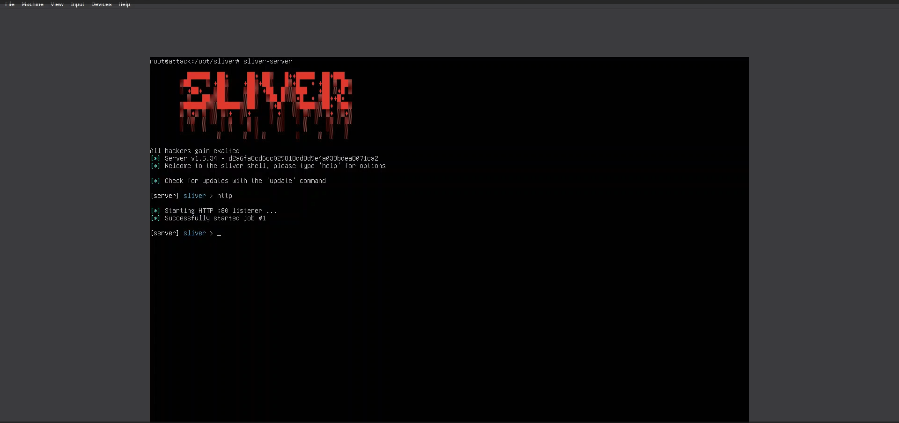
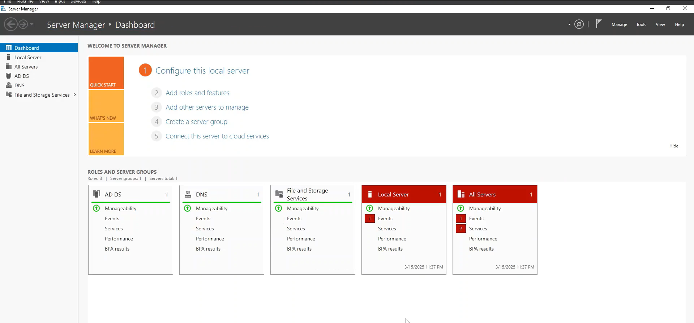
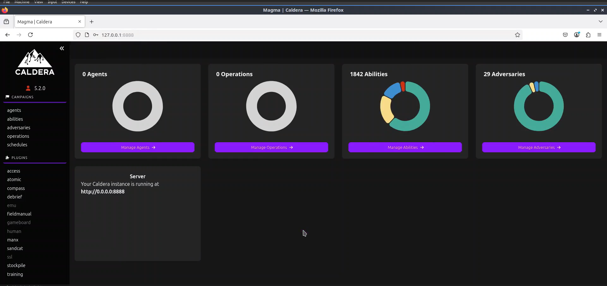

## Cybersecurity SOC Analyst Portfolio

Welcome to my GitHub portfolio! I am an aspiring Cybersecurity SOC Analyst with a passion for protecting digital assets, analyzing security threats, and responding to incidents effectively. Here, you will find my journey into cybersecurity, key projects, skills, and certifications that demonstrate my commitment to securing networks and systems.

### 📑 About Me
- Enthusiastic cybersecurity professional passionate about security operations and incident response.  
- Hands-on experience with threat hunting, SIEM, and network security fundamentals.  
- Constantly learning and adapting to emerging cybersecurity threats and technologies.  
- Committed to following industry best practices and frameworks.

### 🔒 Skills & Expertise
- Security Information and Event Management (SIEM)
- Threat Hunting & Incident Response
- Network Security Fundamentals
- Intrusion Detection & Prevention Systems (IDS/IPS)
- Log Analysis & Monitoring
- Firewall & Endpoint Security
- Basic Scripting (Python, PowerShell)
- Cybersecurity Frameworks** (NIST, MITRE ATT&CK)

### 🖥️ Featured Projects
#### Project 1: **SOC Analyst Home Lab**
Description: Built a virtual lab for hands-on security analysis and incident response using:
   - 🖥️ Ubuntu Server  
   - 💻 Windows 10  
   - 🕵️ Sliver C2  
   - 📊 Sysmon  
   - 🔍 LimaCharlie

- GitHub Repository: [_View Project_](https://github.com/Yuvraj-Gurung/network-penetration-testing-lab)
- *[Watch the Live Demo](https://www.youtube.com/watch?v=OvzdCgv_mnM)*

#### Project 2: **Active Directory and Splunk Lab**
Description: Configured and monitored Active Directory environments with security logs analysis using:
   - 🏢 Windows Server 2022  
   - 💻 Windows 10  
   - 🖥️ Ubuntu Server 24.04.1  
   - 📊 Splunk  
   - 🔍 Sysmon  

- GitHub Repository: [_View Project_](https://github.com/Yuvraj-Gurung/network-penetration-testing-lab)
- *[Watch the Live Demo](https://www.youtube.com/watch?v=OvzdCgv_mnM)*

#### Project 3: **Adversary Emulation with Wazuh and Caldera**
Description: Simulated real-world attack scenarios and monitored security events using:
   - 🖥️ Ubuntu  
   - 💻 Windows 10  
   - 🛡️ Wazuh  
   - 🎭 Caldera  

- GitHub Repository: [_View Project_](https://github.com/Yuvraj-Gurung/network-penetration-testing-lab)
- *[Watch the Live Demo](https://www.youtube.com/watch?v=OvzdCgv_mnM)*

#### Project 4: **Wireshark | Pcap Traffic Analysis**
Description: Investigate suspicious network activity in an Active Directory (AD) environment.

- GitHub Repository: [_View Project_](https://github.com/Yuvraj-Gurung/network-penetration-testing-lab)
- *[Watch the Live Demo](https://www.youtube.com/watch?v=OvzdCgv_mnM)*

### 📜 Certifications
- Ethical Hacking Essentials (EHE)
- CompTIA Security+ (SYO-601)
- Penetration Testing and Ethical Hacking
- Android Bug Bounty Hunting

### 📚 Education
- **[SRM University Sikkim]**, _Master of Computer Applications_
- **[Sikkim Manipal University - Distance Education]**, _Bachelor of Computer Application_

### 📈 Learning Paths
- **Online Platforms**: TryHackMe, Hack The Box, LetsDefend - Blue Team Training

### 🎯 Goals & Aspirations
- Continuously improving my skills in SOC operations and security analysis.  
- Developing Red/Blue Teaming Skills.
- Learning advanced threat intelligence techniques.

### 📫 Get in Touch
Feel free to connect with me for collaborations, discussions, or knowledge sharing!  

📧 Email: [yuvrajgurung192@gmail.com](mailto:yuvrajgurung192@gmail.com)

🌐 LinkedIn: [My LinkedIn Profile](https://www.linkedin.com/in/yuvraj-gurung)

---

Thank you for visiting my cybersecurity portfolio!
