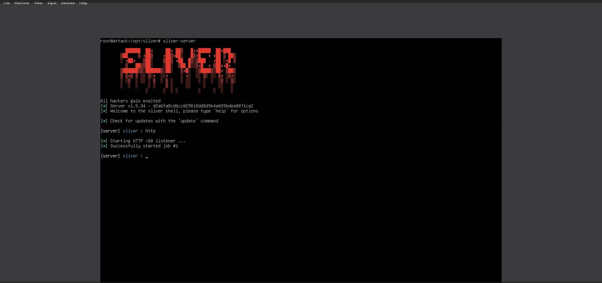
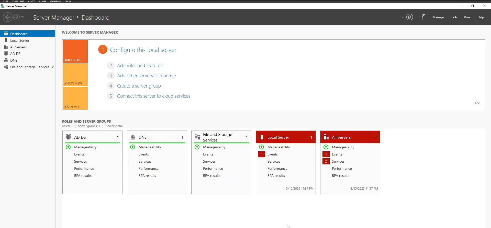
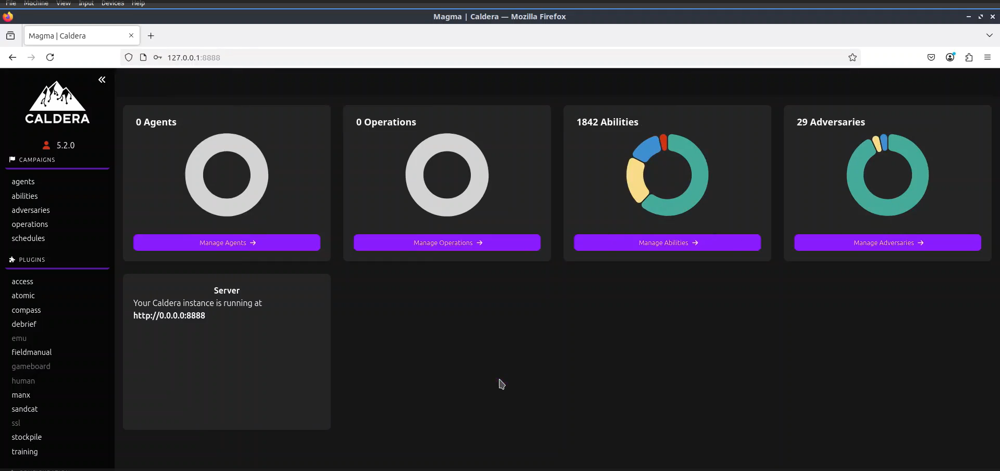
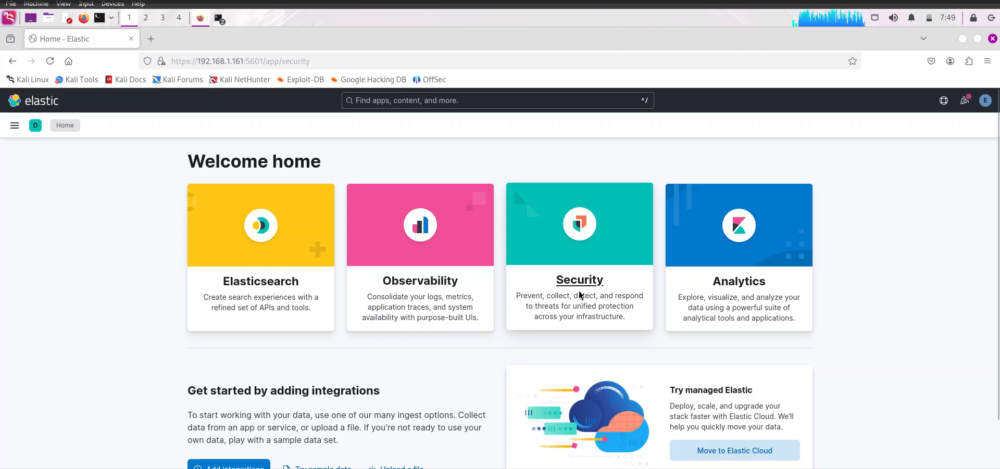

## Cybersecurity SOC Analyst Portfolio

Welcome to my GitHub portfolio! I am an Entry-Level Cybersecurity / SOC Analyst with a passion for protecting digital assets, analyzing security threats, and responding to incidents effectively. Here, you will find my journey into cybersecurity, key projects, skills, and certifications that demonstrate my commitment to securing networks and systems.

### 📑 About Me
- Enthusiastic cybersecurity professional passionate about security operations and incident response.  
- Hands-on experience with threat hunting, SIEM, and network security fundamentals.  
- Constantly learning and adapting to emerging cybersecurity threats and technologies.  
- Committed to following industry best practices and frameworks.

### 🔒 Skills & Expertise
- Penetration Testing & Vulnerability Management
- Security Information and Event Management (SIEM)
- Threat Hunting & Incident Response
- Network Security Fundamentals
- Intrusion Detection & Prevention Systems (IDS/IPS)
- Log Analysis & Monitoring
- Phishing Email Analysis
- Basic Scripting (Python, PowerShell)
- Cybersecurity Frameworks (MITRE ATT&CK, Cyber Kill Chain, OWASP Top 10)

### 🛠️ Tools and Softwares

### 🖥️ Featured Projects
#### Project 1: **Cybersecurity SOC Analyst Home Lab**
Simulated Threat Detection & Response Workflows in a Virtual SOC Environment
- Designed and configured a comprehensive Security Operations Center (SOC) environment, replicating real-world
threat detection and response workflows, leading to a 30% improvement in incident detection time.
- Deployed Sysmon for endpoint telemetry and integrated LimaCharlie for cloud-based log aggregation and
analysis, enhancing log visibility and threat intelligence by 40%.

- GitHub Repository: [_View Project_](https://github.com/Yuvraj-Gurung/soc-analyst-home-lab)
- *[Watch the Live Demo](https://drive.google.com/file/d/1yk1wY3xawjRuF7ueawSSRQPlewZ3VpDv/view?usp=sharing)*

#### Project 2: **Active Directory and Splunk Log Management Lab**
Centralized Log Management & Threat Hunting in Active Directory Environment
- Built and administered a Windows domain with Active Directory, simulating enterprise-level authentication and
access control systems.
- Implemented Sysmon across all endpoints, centralizing logs in Splunk for real-time correlation and threat hunting,
identifying 15+ simulated attack vectors through data analysis. 

- GitHub Repository: [_View Project_](https://github.com/Yuvraj-Gurung/active-directory-and-splunk-lab)
- *[Watch the Live Demo](https://drive.google.com/file/d/1fM1UTTvvtHB889f9HkHbI_6HDMC9Jq-t/view?usp=sharing)*

#### Project 3: **Adversary Emulation with Wazuh and Caldera**
Simulating Attacker Behavior to Strengthen Security Monitoring
- Used Caldera and Atomic Red Team to emulate 20+ MITRE ATT&CK techniques, identifying key weaknesses in
endpoint and network defenses.
- Integrated Wazuh for real-time log analysis, implementing custom rules that detected anomalous behaviors,
reducing alert fatigue by 25% through automated incident classification. 

- GitHub Repository: [_View Project_](https://github.com/Yuvraj-Gurung/adversary-emulation-with-wazuh-and-caldera)
- *[Watch the Live Demo](https://drive.google.com/file/d/1AilRTvi4gNgcJWk_HkmiB9VnDpKSVVUH/view?usp=sharing)*

#### Project 4: **Wireshark | PCAP Traffic Analysis**
Network Traffic Analysis for Malicious Activity Detection
- Analyzed network traffic captures (PCAP) using Wireshark to detect and respond to potential indicators of
compromise (IoC), uncovering several instances of DNS tunneling and port scanning.
- Dissected and identified over 10 malicious payloads across various network protocols, enhancing detection
capabilities for future incidents.

- GitHub Repository: [_View Project_](https://github.com/Yuvraj-Gurung/wireshark-pcap-traffic-analysis)
- *[Watch the Live Demo](https://drive.google.com/file/d/16mir1P8zmAmD2IaWFJhX-LFyclmtuatT/view?usp=sharing
)*

#### Project 5: **Elastic Stack (ELK) | SIEM Log Analysis**
Using Elastic Stack for Log Analysis and Red Team Operations
- Deployed Elastic Stack (Kali Purple) to ingest and visualize logs from simulated attack scenarios, improving SIEM 
detection accuracy by 35%.
- Conducted red team operations using Mythic C2 and Metasploit, generating threat data that was successfully 
ingested into ELK for analysis and reporting.

- GitHub Repository: [_View Project_](https://github.com/Yuvraj-Gurung/siem-log-analysis-elastic-stack)
- *[Watch the Live Demo](https://drive.google.com/file/d/1XtaOzGn0ViDt6weHUrk0ydJZszWnbi0U/view?usp=sharing)*

### 📜 Certifications
- Ethical Hacking Essentials (EHE)
- CompTIA Security+ (SY0-601)
- Penetration Testing and Ethical Hacking
- Android Bug Bounty Hunting

### 📚 Education
- **[SRM University Sikkim]**, _Master of Computer Applications_
- **[Sikkim Manipal University - Distance Education]**, _Bachelor of Computer Application_

### 📈 Learning Paths
- **Online Platforms**: TryHackMe, Hack The Box, LetsDefend - Blue Team Training

### 🎯 Goals & Aspirations
- Continuously improving my skills in SOC operations and security analysis.  
- Developing Red/Blue Teaming Skills.
- Learning advanced threat intelligence techniques.

### 📫 Get in Touch
Feel free to connect with me for collaborations, discussions, or knowledge sharing!  

📧 Email: [yuvrajgurung192@gmail.com](mailto:yuvrajgurung192@gmail.com)

🌐 LinkedIn: [My LinkedIn Profile](https://www.linkedin.com/in/yuvraj-gurung)

---

Thank you for visiting my cybersecurity portfolio!
